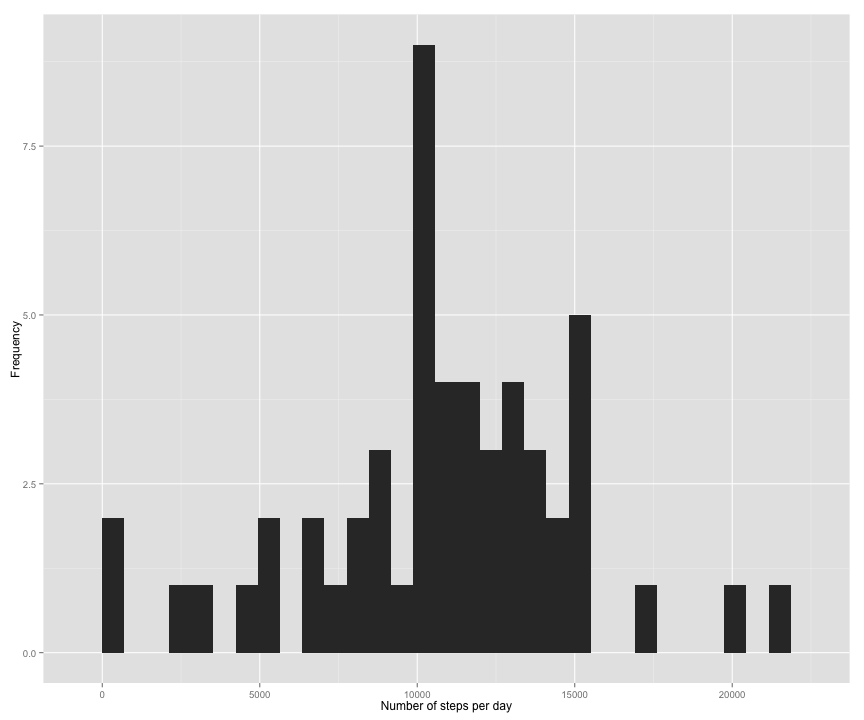
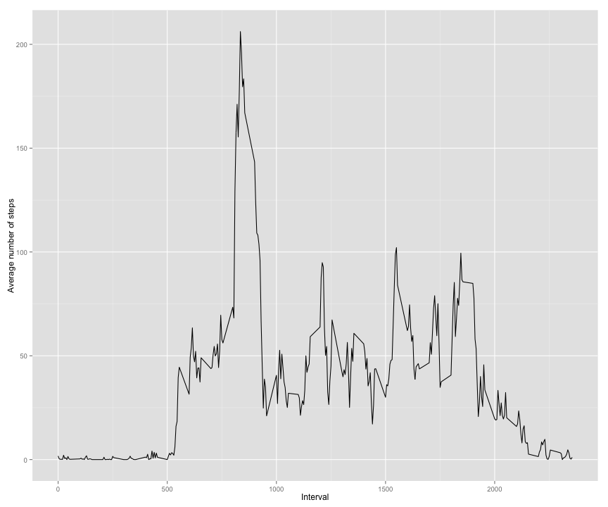
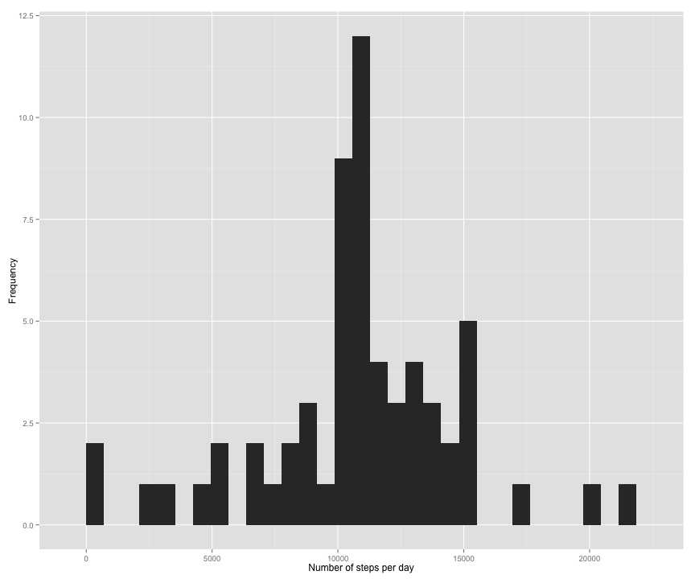
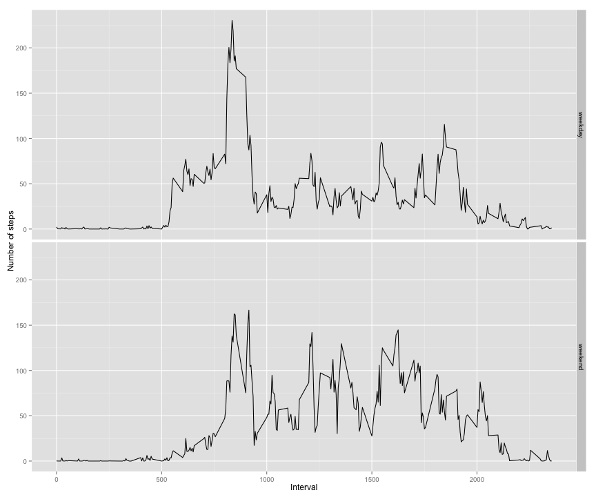

# Reproducible Research: Peer Assignment 1

## Loading and preprocessing the data

First load the steps data. The data must be extracted from the `activity.zip` archive provided in the repository into a `data` folder at the root of the repository.


```r
d <- read.csv('./data/activity.csv', stringsAsFactors = FALSE)
```

I change the date to be in a correct format:


```r
d$date <- as.Date(d$date)
str(d)
```

```
## 'data.frame':	17568 obs. of  3 variables:
##  $ steps   : int  NA NA NA NA NA NA NA NA NA NA ...
##  $ date    : Date, format: "2012-10-01" "2012-10-01" ...
##  $ interval: int  0 5 10 15 20 25 30 35 40 45 ...
```

## What is the mean total number of steps taken each day?

For this part of the assignment, I will remove the missing values in the dataset. I create the dataset `dd` for this purpose (I'm using the `dplyr` package).


```r
library(dplyr)
```

```
## 
## Attaching package: 'dplyr'
## 
## The following object is masked from 'package:stats':
## 
##     filter
## 
## The following objects are masked from 'package:base':
## 
##     intersect, setdiff, setequal, union
```

```r
dd <- d %>% filter(!is.na(steps))
```

1. I calculate the total number of steps taken per day.


```r
steps_by_day <- dd %>% 
    group_by(date) %>% 
    summarise(total_steps = sum(steps))
```

2. I build an histogram of the total number of steps taken each day, using the `ggplot2` library. *Note : This is an histogram, not a barplot. As per my understanding, I'm showing how often the individual walks a certain number of steps (see this [Coursera forum thread](https://class.coursera.org/repdata-031/forum/thread?thread_id=21) for the difference.)*


```r
library(ggplot2)
ggplot(data=steps_by_day, aes(x=total_steps)) + 
    geom_histogram() +
    xlab("Number of steps per day") +
    ylab("Frequency")
```

 

3. I then calculate and report the mean and median of the total number of steps taken each day.

Here is the mean :


```r
mean(steps_by_day$total_steps)
```

```
## [1] 10766.19
```

and here is the median :


```r
median(steps_by_day$total_steps)
```

```
## [1] 10765
```

## What is the average daily activity pattern?

1. I make a time series plot of the 5 minute interval and the average number of steps taken, averaged across all days.


```r
steps_by_interval <- dd %>% 
    group_by(interval) %>% 
    summarise(total=mean(steps))
```


```r
ggplot(data=steps_by_interval, aes(x=interval, y=total)) +
    geom_line() +
    xlab("Interval") +
    ylab("Average number of steps")
```

 

2. I calculate which 5-minute interval, on average across al the days in the dataset, contains the maximum number of steps.


```r
top_n(steps_by_interval, 1, total)
```

```
## Source: local data frame [1 x 2]
## 
##   interval    total
## 1      835 206.1698
```

The maximal average number of steps (`206.1698`) is taken at 8:35 (interval `835`).

## Inputing missing values

Note that there are a number of days/intervals where there are missing values (coded as `NA`). The presence of missing days may introduce bias into some calculations or summaries of the data.

1. I calculate and report the total number of missing values in the dataset (i.e. the total number of rows with NAs)


```r
d %>%
    filter(is.na(steps)) %>%
    count
```

```
## Source: local data frame [1 x 1]
## 
##      n
## 1 2304
```

There are `2304` missing values in the dataset.

2. I'm going to replace the missing values with the mean for this interval using the `steps_by_interval` dataframe computed earlier.


```r
dd <- d %>%
    rowwise() %>%
    mutate(steps = replace(steps, is.na(steps), steps_by_interval$total[steps_by_interval$interval == interval]))
```

3. I then make a histogram of the total number of steps taken each day and calculate and report the mean and median total number of steps taken per day. 


```r
new_steps_by_day <- dd %>% 
    group_by(date) %>% 
    summarise(total_steps = sum(steps))
```

```
## Warning: Grouping rowwise data frame strips rowwise nature
```


```r
ggplot(data=new_steps_by_day, aes(x=total_steps)) + 
    geom_histogram() +
    xlab("Number of steps per day") +
    ylab("Frequency")
```

 

And here is the new mean :

```r
mean(new_steps_by_day$total_steps)
```

```
## [1] 10766.19
```

And the new median :


```r
median(new_steps_by_day$total_steps, na.rm=TRUE)
```

```
## [1] 10766.19
```

As we can see, the impact of imputing missing data on the etimate is really small.

## Are there differences in activity patterns between weekdays and weekends?

1. I create a new factor variable in the dataset that I will call `daytype` with two levels – `weekday` and `weekend` indicating whether a given date is a weekday or weekend day.


```r
dd <- dd %>%
    ungroup %>%
    mutate(daytype = as.factor(ifelse(weekdays(date) == "Sunday" | weekdays(date) == "Saturday", "weekend", "weekday")))
```

I then calculate the average number of steps for each type of day and each interval:


```r
steps_by_interval <- dd %>% 
    group_by(daytype, interval) %>% 
    summarise(total=mean(steps))
```

And plot the result:


```r
ggplot(data=steps_by_interval, aes(x=interval, y=total)) +
    geom_line() +
    xlab("Interval") +
    ylab("Number of steps") +
    facet_grid(daytype~.)
```

 

We can see that on a weekday, the individual seems to walk a lot in the morning. He probably walks to work, or exercise in the morning. He also seems to have a work where he mostly seats.

On weekends, he tends to wake up later, and his activity is more evenly distributed across the day.
